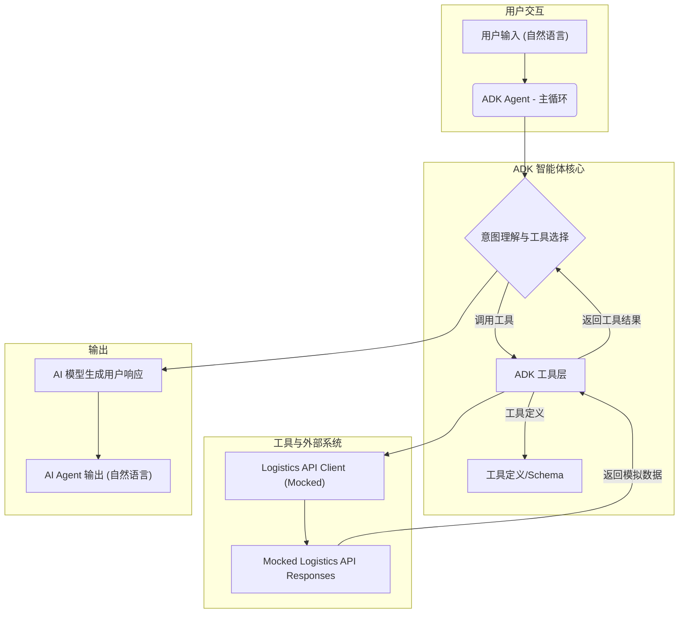
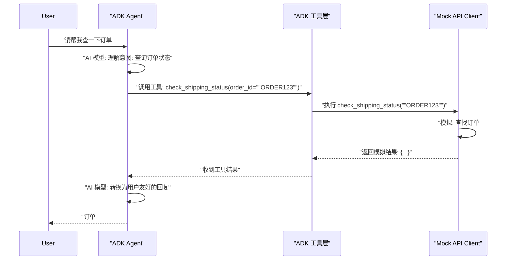
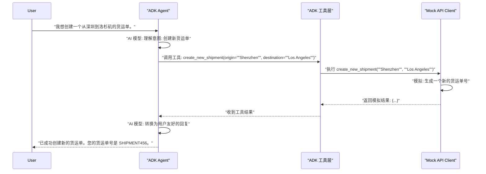

# 架构图

```mermaid
graph TD
    subgraph "用户交互"
        A["用户输入 (自然语言)"] --> B("ADK Agent - 主循环")
    end

    subgraph "ADK 智能体核心"
        B --> C{"意图理解与工具选择"}
        C -- "调用工具" --> D["ADK 工具层"]
        D -- "工具定义" --> E["工具定义/Schema"]
    end

    subgraph "工具与外部系统"
        D --> F["Logistics API Client (Mocked)"]
        F --> G["Mocked Logistics API Responses"]
        G -- "返回模拟数据" --> D
    end

    subgraph "输出"
        D -- "返回工具结果" --> C
        C --> H["AI 模型生成用户响应"]
        H --> I["AI Agent 输出 (自然语言)"]
    end

```

## 用户案例 1: 查询货运状态

```mermaid
sequenceDiagram
    participant User
    participant ADKAgent as "ADK Agent"
    participant ToolLayer as "ADK 工具层"
    participant MockAPIClient as "Mock API Client"

    User->>ADKAgent: "请帮我查一下订单 #ORDER123 的物流状态。"
    ADKAgent->>ADKAgent: "AI 模型: 理解意图: 查询订单状态"
    ADKAgent->>ToolLayer: "调用工具: check_shipping_status(order_id=""ORDER123"")"
    ToolLayer->>MockAPIClient: "执行 check_shipping_status(""ORDER123"")"
    MockAPIClient->>MockAPIClient: "模拟: 查找订单 #ORDER123 的状态"
    MockAPIClient-->>ToolLayer: "返回模拟结果: {...}"
    ToolLayer-->>ADKAgent: "收到工具结果"
    ADKAgent->>ADKAgent: "AI 模型: 转换为用户友好的回复"
    ADKAgent-->>User: "订单 #ORDER123 目前在上海中转中心，预计2024年12月15日送达。"
    
```

## 用户案例 2: 创建新货运单

```mermaid
sequenceDiagram
    participant User
    participant ADKAgent as "ADK Agent"
    participant ToolLayer as "ADK 工具层"
    participant MockAPIClient as "Mock API Client"

    User->>ADKAgent: "我想创建一个从深圳到洛杉矶的货运单。"
    ADKAgent->>ADKAgent: "AI 模型: 理解意图: 创建新货运单"
    ADKAgent->>ToolLayer: "调用工具: create_new_shipment(origin=""Shenzhen"", destination=""Los Angeles"")"
    ToolLayer->>MockAPIClient: "执行 create_new_shipment(""Shenzhen"", ""Los Angeles"")"
    MockAPIClient->>MockAPIClient: "模拟: 生成一个新的货运单号"
    MockAPIClient-->>ToolLayer: "返回模拟结果: {...}"
    ToolLayer-->>ADKAgent: "收到工具结果"
    ADKAgent->>ADKAgent: "AI 模型: 转换为用户友好的回复"
    ADKAgent-->>User: "已成功创建新的货运单。您的货运单号是 SHIPMENT456。"
```